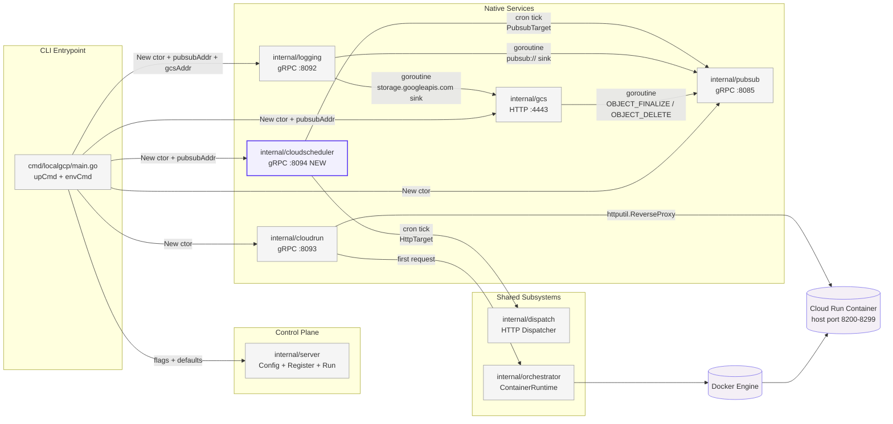
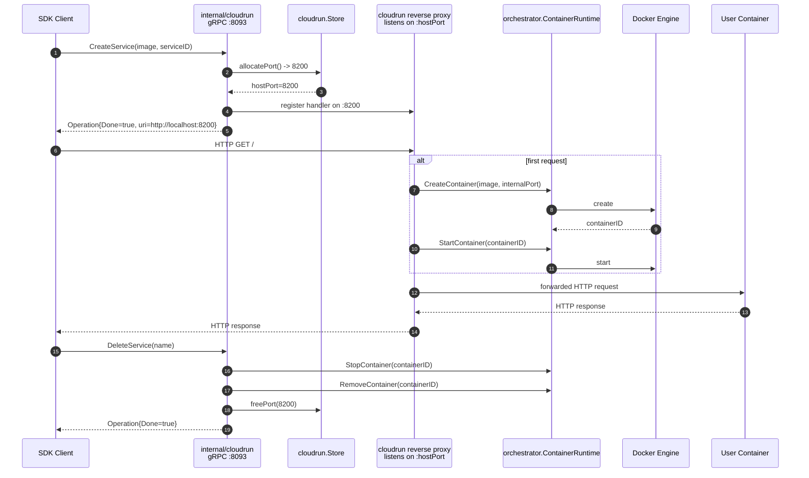
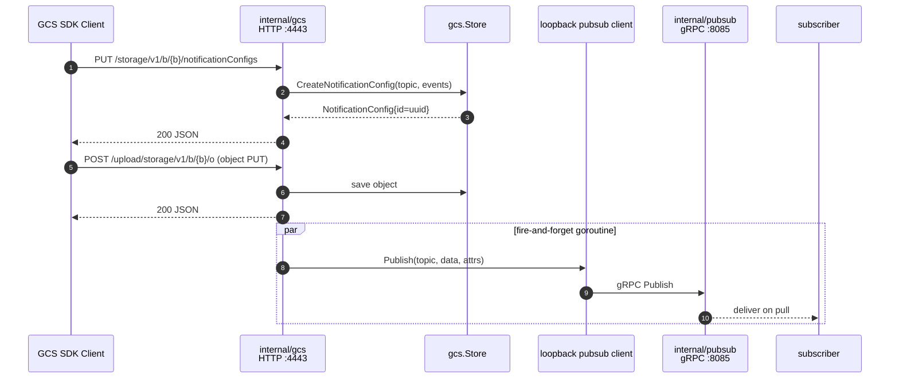
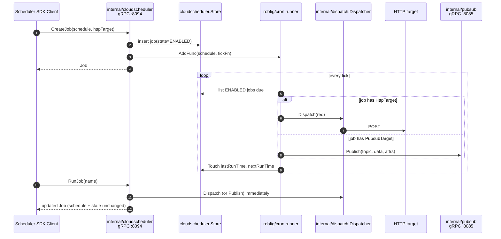
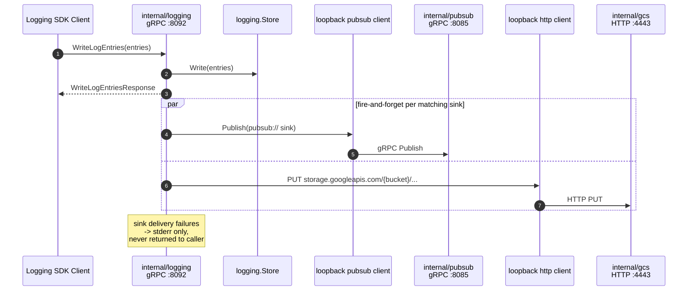

# Technical Specification

# 0. Agent Action Plan

## 0.1 Intent Clarification

### 0.1.1 Core Feature Objective

Based on the prompt, the Blitzy platform understands that the new feature requirement is to extend the existing `localgcp` GCP emulator — a single Go 1.26.1 binary that today emulates fourteen GCP services (nine native plus five Docker-orchestrated) — with four discrete, coordinated feature extensions that graduate four of the nine native services from control-plane-only or metadata-only surfaces into services that perform real cross-service side effects through loopback integration paths.

Expressed with technical precision, the four feature extensions are:

- **Extension A — Cloud Run actual execution**: Replace the current metadata-only stub in `internal/cloudrun/` (which today returns synthetic `https://{serviceID}-localgcp.run.app` URIs but never launches a process) with a real Docker container lifecycle manager plus an in-process HTTP reverse proxy. `CreateService` must allocate a host port from a bounded pool (8200–8299) and register the container image without starting the container; the first HTTP request to the service URI must trigger on-demand `CreateContainer` + `StartContainer` through the existing `internal/orchestrator.ContainerRuntime` abstraction; `DeleteService` must call `StopContainer` + `RemoveContainer` and return the allocated port to the pool. All service URIs returned from `GetService` and `ListServices` must become `http://localhost:{hostPort}`. When `cfg.NoDocker` is true, `CreateService` must succeed with a non-empty stub URI and unconditionally skip all container operations.

- **Extension B — GCS → Pub/Sub notifications**: Wire the existing Cloud Storage REST emulator in `internal/gcs/` to emit GCS-canonical notification events to a configured Pub/Sub topic via loopback gRPC when objects are written or deleted. This requires adding a per-bucket `notificationConfigs` map to the store, exposing three new HTTP handlers — `PUT /storage/v1/b/{bucket}/notificationConfigs` (create with UUID id), `GET /storage/v1/b/{bucket}/notificationConfigs/{id}` (retrieve or 404), and `DELETE /storage/v1/b/{bucket}/notificationConfigs/{id}` (remove, 204) — and, on each matching object `PUT`/`POST` (event type `OBJECT_FINALIZE`) or `DELETE` (`OBJECT_DELETE`), spawning a goroutine that publishes a JSON payload `{kind, id, selfLink, name, bucket, contentType, timeCreated, updated}` with attributes `{eventType, bucketId}` to the configured topic via loopback gRPC at `pubsubAddr`.

- **Extension C — Cloud Scheduler (new service)**: Add a brand-new native service in `internal/cloudscheduler/` listening on port 8094 via gRPC, registered with `schedulerpb.RegisterCloudSchedulerServer`. The service implements eight in-scope RPCs (`CreateJob`, `GetJob`, `ListJobs`, `DeleteJob`, `UpdateJob`, `RunJob`, `PauseJob`, `ResumeJob`) backed by an in-memory job map keyed by job name. A single `robfig/cron/v3` runner goroutine ticks through enabled jobs on their 5-field cron schedules; each firing dispatches `HttpTarget` jobs through `internal/dispatch.Dispatcher` and `PubSubTarget` jobs through loopback Pub/Sub gRPC. `RunJob` performs an immediate single dispatch without mutating `schedule` or `state`.

- **Extension D — Cloud Logging sinks**: Extend `internal/logging/` with five new sink management RPCs (`CreateSink`, `GetSink`, `UpdateSink`, `DeleteSink`, `ListSinks`) backed by a `sinks map[string]Sink` where each `Sink` holds `{name, destination, filter}`. Destinations accept `pubsub://projects/{project}/topics/{topic}` or `storage.googleapis.com/{bucket}`. On `WriteLogEntries`, after writing to the in-memory store, iterate sinks whose filter matches each entry and spawn a goroutine per match that routes the entry to GCS via HTTP PUT to `gcsAddr` or to Pub/Sub via loopback gRPC to `pubsubAddr`. Sink delivery failures are logged to stderr and never surfaced to the `WriteLogEntries` caller.

The implicit requirements surfaced by these four explicit extensions are:

- A **cross-service loopback topology** must be established wherein `internal/gcs/`, `internal/logging/`, and `internal/cloudscheduler/` each gain the ability to open an internal gRPC client (and for logging, an internal HTTP client) against the peer service endpoints of `internal/pubsub/` at `localhost:PortPubSub` and `internal/gcs/` at `localhost:PortGCS`. The existing `cmd/localgcp/main.go` entrypoint becomes responsible for composing these addresses at startup and threading them through additive trailing parameters on `gcs.New(...)` and `logging.New(...)`.

- A **bounded host port pool** must be introduced into `internal/cloudrun/store.go` covering ports 8200–8299 (100 concurrent services maximum), managed as an in-use set with deterministic `allocatePort()` and `freePort(p)` semantics and a `codes.ResourceExhausted` overflow return contract.

- A **fire-and-forget goroutine model** must govern all cross-service delivery paths so that the latency of inter-service calls never leaks into the latency of the caller's RPC or HTTP response. Delivery errors are observable only via stderr.

- A **new dependency set** must be integrated into `go.mod`: `github.com/robfig/cron/v3` v3.0.1 for cron parsing and the tick runner, and `cloud.google.com/go/scheduler` v1.14.0 for the `schedulerpb` generated types and `UnimplementedCloudSchedulerServer` embedding.

- A **new CLI surface** adds `--port-cloud-scheduler` (default 8094) to `cmd/localgcp/main.go`, a corresponding `PortCloudScheduler int` field on `server.Config`, a `CLOUD_SCHEDULER_EMULATOR_HOST=localhost:8094` line in `localgcp env` output, and an additional `8094` entry in the `Dockerfile` `EXPOSE` directive.

- A **rigorous preservation contract** constrains all four extensions: every existing `internal/*/service_test.go` file must compile and pass without modification to its source; all existing CLI flags and default port assignments must remain; all existing proto handler method signatures and exported store method signatures across `internal/gcs/`, `internal/logging/`, `internal/pubsub/`, `internal/cloudrun/` must remain byte-identical; the `server.Service` interface and `orchestrator.ContainerRuntime` interface must remain byte-identical; the `server.Config` struct permits additive fields only.

### 0.1.2 Special Instructions and Constraints

The user's prompt carries a dense set of architectural directives that constrain how the above objectives are implemented. These directives are preserved verbatim below and enforced throughout the implementation plan:

- **CRITICAL — ContainerRuntime is the only Docker boundary** (Rule 1 from the user's prompt): `internal/cloudrun/` MUST NOT contain direct `docker/docker` SDK calls. All container operations MUST go through the pre-existing `internal/orchestrator.ContainerRuntime` interface. Verification criterion: `grep -r "docker.NewClientWithOpts" internal/cloudrun/` returns zero matches.

- **CRITICAL — Service package file structure is mandatory** (Rule 2): Every service package must contain `service.go`, `store.go`, and `service_test.go`. This applies to the new `internal/cloudscheduler/` package and all modified packages.

- **CRITICAL — Request handlers must not block on inter-service calls** (Rule 3): GCS notification delivery, Logging sink fan-out, and Cloud Scheduler dispatch must execute in goroutines separate from the request-handling path. Verification: no `pubsubClient.Publish()` or synchronous `http.Post()` calls appear on the direct handler execution path in `internal/gcs/service.go` or `internal/logging/service.go`.

- **CRITICAL — `--no-docker` mode must be unconditionally honored** (Rule 4): When `cfg.NoDocker` is true, `CreateService` must succeed with a non-empty stub URI. Container start, stop, and remove calls must be skipped entirely — no conditional Docker availability check. A unit test with `NoDocker=true` must confirm `CreateService` returns a non-empty URI without invoking `ContainerRuntime`.

- **Idiomatic gRPC registration pattern** (Rule 5): The Cloud Scheduler service must register with `schedulerpb.RegisterCloudSchedulerServer(grpcServer, svc)` — matching the pattern of all other gRPC services in the codebase (Pub/Sub, Secret Manager, Firestore, Cloud Tasks, KMS, Logging, Cloud Run).

- **Out-of-scope RPCs must return a canonical unimplemented error** (Rule 6): All `CloudScheduler` and `CloudRun` RPCs not listed in the in-scope set must return `codes.Unimplemented` with the exact message `"localgcp: {FullMethodName} not yet supported"`.

- **Existing handler and store signatures are immutable** (Rule 7 + 7a): Proto handler method signatures and exported store method signatures in `internal/gcs/`, `internal/logging/`, `internal/pubsub/`, `internal/cloudrun/` must not be modified beyond additive changes. Exception (Rule 7a): `gcs.New(...)` and `logging.New(...)` may accept additional trailing parameters, and when any such address parameter is empty the corresponding loopback delivery path must be silently skipped with no error and no log.

- **Cloud Run port pool is a bounded, tracked resource** (Rule 8): Ports 8200–8299 managed as an in-use set in `internal/cloudrun/store.go`. Overflow returns `codes.ResourceExhausted` with the exact message `"localgcp: cloud run port pool exhausted (max 100 concurrent services)"`.

- **Cross-service wiring paths require dedicated integration tests** (Rule 9): GCS→PubSub notification delivery, Logging→GCS sink routing, and Logging→PubSub sink routing must each have one integration test tagged `//go:build integration` that starts both endpoint services, exercises the wiring path end-to-end, and asserts downstream delivery. `go test -tags integration ./internal/...` must pass with all three present and green.

**Architectural constraints and conventions derived from the existing codebase** (maintained, not introduced):

- All native services implement `server.Service{Name() string; Start(ctx, addr) error}` — the new `internal/cloudscheduler/` package adopts this contract without modification.
- All gRPC native services embed the generated `UnimplementedXxxServer` stub — Cloud Scheduler embeds `schedulerpb.UnimplementedCloudSchedulerServer`.
- All gRPC native services register a unary `loggingInterceptor` gated by the `quiet` flag and call `reflection.Register(srv)` — Cloud Scheduler follows the same pattern.
- All stores protect state with `sync.RWMutex` — the cloudscheduler store, the GCS notification map, the Logging sink map, and the Cloud Run port pool all follow this convention.
- Graceful shutdown uses `go func() { <-ctx.Done(); srv.GracefulStop() }()` for gRPC servers and `srv.Shutdown(shutdownCtx)` with a 3-second timeout for HTTP servers.

**User Example — preserved verbatim from the prompt for integration topology**:

```plaintext
User Example: Integration topology

GCS write       → [gcs/service.go]       → goroutine → Pub/Sub loopback (pubsubAddr)
Scheduler tick  → [dispatch/dispatcher.go] → HTTP target | Pub/Sub loopback
Log write       → [logging/service.go]   → goroutine → GCS loopback (gcsAddr) | Pub/Sub loopback (pubsubAddr)
Cloud Run invoke → [cloudrun/service.go] → orchestrator.ContainerRuntime → Docker → container HTTP
```

**Web search research performed to support implementation**:

- Verified the latest stable version of `github.com/robfig/cron/v3` via `go list -m -versions` — resolved to **v3.0.1**. This is the canonical Go cron library using the 5-field standard cron format (minute, hour, day-of-month, month, day-of-week), exactly matching the schedule field format required by the Cloud Scheduler API.
- Verified the latest stable version of `cloud.google.com/go/scheduler` via `go list -m -versions` — resolved to **v1.14.0**. This module exposes the `cloud.google.com/go/scheduler/apiv1/schedulerpb` sub-package providing `UnimplementedCloudSchedulerServer`, the `Job`, `HttpTarget`, `PubsubTarget`, `AppEngineHttpTarget`, `*JobRequest`, `*JobResponse`, and `State` proto types required to implement the service.
- Confirmed that the `schedulerpb` package is under the same module (`cloud.google.com/go/scheduler`) as the typed client and that a single module import covers both the server stubs used by the emulator and the proto request/response types.

### 0.1.3 Technical Interpretation

These four feature requirements translate to the following technical implementation strategy, mapping each requirement to concrete codebase actions using the format "To [implement feature], we will [create/modify/extend] [specific components]":

- **To implement Cloud Run actual execution**, we will (a) extend the `serviceEntry` struct in `internal/cloudrun/store.go` with `containerID string` and `hostPort int` fields, (b) add an in-use set-backed port pool over ports 8200–8299 with `allocatePort()` and `freePort(p)` methods on `Store`, (c) modify `CreateService` in `internal/cloudrun/service.go` to allocate a port and persist the image reference without starting a container, (d) add an in-process HTTP reverse proxy handler on port `hostPort` that on the first request invokes `runtime.CreateContainer` then `runtime.StartContainer` from `internal/orchestrator.ContainerRuntime`, forwards the request with a 30-second proxy timeout, and returns the container's response, (e) modify `DeleteService` to call `runtime.StopContainer` then `runtime.RemoveContainer` and invoke `freePort`, and (f) short-circuit all container execution when `cfg.NoDocker` is true while still returning a non-empty stub URI from `CreateService`.

- **To implement GCS→Pub/Sub notifications**, we will (a) add `notificationConfigs map[string]NotificationConfig` per bucket in `internal/gcs/store.go` with thread-safe CRUD, (b) register three new HTTP handlers in `internal/gcs/service.go` for `notificationConfigs` endpoints under `/storage/v1/b/{bucket}/notificationConfigs`, (c) on each object `PUT`/`POST`/`DELETE` handler execution, match the event against the bucket's configured notification event types and, for each match, spawn a `go func()` that dials `pubsubAddr` via gRPC, builds a canonical GCS JSON notification payload plus `{eventType, bucketId}` attributes, and calls `Publish`, (d) extend the `gcs.New(...)` constructor with a trailing `pubsubAddr string` argument and silently skip delivery when the address is empty, and (e) thread `fmt.Sprintf("localhost:%d", cfg.PortPubSub)` through from `cmd/localgcp/main.go` at service registration time.

- **To implement Cloud Scheduler**, we will (a) create the new `internal/cloudscheduler/` package with the mandatory `service.go`/`store.go`/`service_test.go` triad, (b) implement the in-memory `Store` in `store.go` with a job map keyed by fully-qualified job name, each entry holding `{name, schedule, httpTarget|pubsubTarget, state, lastRunTime, nextRunTime}`, (c) implement `Service` in `service.go` embedding `schedulerpb.UnimplementedCloudSchedulerServer` and providing the eight in-scope RPCs — `CreateJob`, `GetJob`, `ListJobs`, `DeleteJob`, `UpdateJob`, `RunJob`, `PauseJob`, `ResumeJob` — with all other `CloudScheduler` RPCs returning `codes.Unimplemented` with the canonical message, (d) start a single `robfig/cron/v3` runner goroutine on `Start()` that iterates `ENABLED` jobs and dispatches to `HttpTarget` via `internal/dispatch.Dispatcher` or to `PubsubTarget` via loopback gRPC to `pubsubAddr`, (e) add the `server.Service` implementation (`Name() string` returns `"Cloud Scheduler"`, `Start(ctx, addr) error` binds the gRPC server on `addr`), (f) add `PortCloudScheduler int` to `server.Config` with default 8094, (g) wire `--port-cloud-scheduler` in `cmd/localgcp/main.go` and register the service via `srv.Register(cloudscheduler.New(...), cfg.PortCloudScheduler)`, and (h) emit `CLOUD_SCHEDULER_EMULATOR_HOST=localhost:8094` from the `env` subcommand and add `8094` to the `Dockerfile` `EXPOSE` list.

- **To implement Cloud Logging sinks**, we will (a) add `sinks map[string]Sink` to `internal/logging/store.go` with `Sink = {name, destination, filter}` plus CRUD methods, (b) add the five sink RPCs — `CreateSink`, `GetSink`, `UpdateSink`, `DeleteSink`, `ListSinks` — to `internal/logging/service.go`, (c) after writing entries in `WriteLogEntries`, iterate sinks whose filter matches each entry and spawn a `go func()` per match that parses the destination scheme, then PUTs to `gcsAddr` for `storage.googleapis.com/...` destinations or publishes to `pubsubAddr` for `pubsub://projects/...` destinations, (d) log any delivery failure to stderr and never surface it to the RPC caller, (e) extend `logging.New(...)` with trailing `pubsubAddr string` and `gcsAddr string` arguments, silently skipping delivery to whichever address is empty, and (f) thread both `fmt.Sprintf("localhost:%d", cfg.PortPubSub)` and `fmt.Sprintf("localhost:%d", cfg.PortGCS)` from `cmd/localgcp/main.go`.

At the integration-topology level, the four extensions establish three new loopback paths inside the single-binary process — GCS→PubSub, Logging→PubSub, Logging→GCS, plus Scheduler→PubSub and Scheduler→HTTP — and one new out-of-process Docker control path — CloudRun→Docker. The goroutine-based fan-out pattern preserves the sub-100ms native-service startup invariant (§1.2.3.1) and the fire-and-forget delivery model preserves the RPC latency characteristics of `WriteLogEntries`, `Publish`, and the GCS upload handlers.

## 0.2 Repository Scope Discovery

### 0.2.1 Comprehensive File Analysis

A full sweep of the repository — rooted at the module path `github.com/slokam-ai/localgcp` — was performed to identify every file and folder affected by the four feature extensions. The findings are grouped by affected package and by modify-vs-create disposition. Wildcard glob patterns are used where multiple files share a common fate.

**Modified source files (existing — edit in place):**

| File path | Touch point for which extension | Nature of modification |
|-----------|--------------------------------|------------------------|
| `internal/cloudrun/service.go` | Extension A (Cloud Run execution) | Rewrite `CreateService`/`DeleteService` + add HTTP reverse proxy handler + honor `NoDocker` short-circuit + add out-of-scope RPC unimplemented error pattern |
| `internal/cloudrun/store.go` | Extension A | Add `containerID` + `hostPort` to the service entry; add port pool (8200–8299) with `allocatePort`/`freePort`; add `ResourceExhausted` overflow |
| `internal/cloudrun/service_test.go` | Extension A (preservation) | MUST NOT be modified — Rule 7 preservation; verify unchanged tests still compile and pass |
| `internal/gcs/service.go` | Extension B (GCS notifications) | Add three `notificationConfigs` HTTP handlers; add goroutine-based publish fan-out on object `PUT`/`POST`/`DELETE`; extend `New(...)` with trailing `pubsubAddr string` |
| `internal/gcs/store.go` | Extension B | Add per-bucket `notificationConfigs map[string]NotificationConfig` with `{id, topicName, eventTypes}`; add CRUD methods under the existing `sync.RWMutex` |
| `internal/gcs/errors.go` | Extension B | Potentially extend with `ErrNotificationConfigNotFound` helper if needed |
| `internal/gcs/gcs_test.go` | Extension B (preservation) | MUST NOT be modified — Rule 7a preservation; must continue to compile with the new constructor signature by relying on default test wiring; any new test coverage for notification configs belongs in separate new test files |
| `internal/gcs/smoke_test.go` | Extension B (preservation) | MUST NOT be modified — existing smoke coverage preserved |
| `internal/logging/service.go` | Extension D (Logging sinks) | Add five sink RPCs (`CreateSink`, `GetSink`, `UpdateSink`, `DeleteSink`, `ListSinks`); extend `WriteLogEntries` with goroutine-based sink fan-out; extend `New(...)` with trailing `pubsubAddr string` and `gcsAddr string` |
| `internal/logging/store.go` | Extension D | Add `sinks map[string]Sink`; add CRUD methods under the existing `sync.RWMutex` |
| `internal/logging/service_test.go` | Extension D (preservation) | MUST NOT be modified — Rule 7a preservation |
| `cmd/localgcp/main.go` | Extensions A, B, C, D | Add `--port-cloud-scheduler` flag + `PortCloudScheduler` field wiring; import `internal/cloudscheduler`; register `cloudscheduler.New(...)`; update `gcs.New(...)` call with `pubsubAddr`; update `logging.New(...)` call with `pubsubAddr` + `gcsAddr`; add `CLOUD_SCHEDULER_EMULATOR_HOST=localhost:8094` to `envCmd` output |
| `internal/server/server.go` | Extensions B, C, D | Additive — add `PortCloudScheduler int` field to `Config`; set default `8094` in `DefaultConfig()`; no renames, no removals |
| `Dockerfile` | Extensions A, B, C, D | Append `8094` to the `EXPOSE` directive; confirm 8200–8299 are not exposed (host networking remains the Cloud Run invocation path) |
| `go.mod` | Extension C | Additive — add `github.com/robfig/cron/v3 v3.0.1`; add `cloud.google.com/go/scheduler v1.14.0`; Go version pinned at 1.26.1 remains |
| `go.sum` | Extension C | Regenerated by `go mod tidy` after dependency additions |

**New source files (create):**

| File path | Purpose | Owning extension |
|-----------|---------|------------------|
| `internal/cloudscheduler/service.go` | `Service` struct embedding `schedulerpb.UnimplementedCloudSchedulerServer`; implements `server.Service`; eight in-scope RPCs; cron runner goroutine bootstrap; dispatcher and loopback Pub/Sub client wiring | Extension C |
| `internal/cloudscheduler/store.go` | In-memory `Store` with `sync.RWMutex`; job map keyed by name; `Create`, `Get`, `List`, `Update`, `Delete`, `Pause`, `Resume`, `Touch` (for `lastRunTime`/`nextRunTime`) methods | Extension C |
| `internal/cloudscheduler/service_test.go` | Unit tests: CRUD round-trip, Pause/Resume state transitions, `RunJob` immediate dispatch without schedule mutation, out-of-scope RPC returns canonical unimplemented error | Extension C |
| `internal/cloudscheduler/dispatch.go` *(optional helper split)* | Per-tick dispatch logic routing `HttpTarget` through `dispatch.Dispatcher` and `PubsubTarget` through loopback gRPC | Extension C |
| `internal/gcs/notifications_test.go` *(new unit test file)* | Unit tests for `notificationConfigs` CRUD handlers (status codes, UUID assignment, 404/204 semantics) | Extension B |
| `internal/gcs/integration_pubsub_test.go` | Integration test tagged `//go:build integration`: starts GCS + Pub/Sub services, creates bucket + notification config, PUTs object, pulls from Pub/Sub subscription, asserts `eventType=OBJECT_FINALIZE` and `bucketId` attributes | Extension B (Rule 9) |
| `internal/logging/integration_pubsub_sink_test.go` | Integration test tagged `//go:build integration`: starts Logging + Pub/Sub services, creates Pub/Sub sink, writes log entry, pulls from subscription, asserts payload | Extension D (Rule 9) |
| `internal/logging/integration_gcs_sink_test.go` | Integration test tagged `//go:build integration`: starts Logging + GCS services, creates GCS sink, writes log entry, asserts GCS endpoint received the routed entry | Extension D (Rule 9) |
| `internal/cloudrun/proxy.go` *(new implementation file)* | In-process HTTP reverse proxy handler: per-service listener on the allocated host port, first-request lazy container start via `ContainerRuntime`, method/header/body pass-through, 30-second proxy timeout | Extension A |
| `internal/cloudrun/nodocker_test.go` *(new unit test file)* | Unit test asserting `CreateService` with `NoDocker=true` returns a non-empty stub URI without any `ContainerRuntime` call (Rule 4 verification) | Extension A |
| `internal/cloudrun/portpool_test.go` *(new unit test file)* | Unit test asserting port allocation uniqueness, reuse after `freePort`, and `ResourceExhausted` on 101st allocation with canonical error message (Rule 8 verification) | Extension A |

**Read-only files (consumed, must not be modified):**

| File path | Why consumed read-only |
|-----------|------------------------|
| `internal/orchestrator/runtime.go` | `ContainerRuntime` interface is the only permitted Docker boundary — its signatures must remain byte-identical (Rule 1, Rule 7). Consumer: `internal/cloudrun/service.go` |
| `internal/orchestrator/lazy.go` | Read-only; existing orchestrated-services lazy-start flow is unchanged |
| `internal/orchestrator/config.go` | Read-only; existing orchestrated-services registry is unchanged |
| `internal/dispatch/dispatcher.go` | Reused by `internal/cloudscheduler/` for `HttpTarget` dispatch with default `MaxRetries:3, InitialBackoff:1s, Multiplier:2.0, MaxBackoff:10s, Timeout:30s` |
| `internal/server/service.go` | `Service` interface (`Name()`, `Start(ctx, addr) error`) must remain byte-identical — the new `cloudscheduler.Service` implements it |
| `internal/pubsub/**` | Read-only consumer side; loopback clients dial `localhost:{PortPubSub}` as an ordinary gRPC client |
| `internal/auth/**` | Read-only; credentials bootstrap is unchanged |

**Configuration, build, and deployment files affected:**

| File path | Change |
|-----------|--------|
| `Dockerfile` | Append `8094` to the `EXPOSE` directive (currently `EXPOSE 4443 8085 8086 8088 8089 8090` — must become `EXPOSE 4443 8085 8086 8088 8089 8090 8091 8092 8093 8094` for correctness; the current Dockerfile is missing 8091/8092/8093 and 8094 is the new addition) |
| `.goreleaser.yml` | Read-only — no per-service wiring; binary distribution is unaffected |
| `.github/workflows/*.yml` | Read-only unless CI is extended to run `go test -tags integration` (Rule 9 + Gate 8) — if so, a single-line tag flag is added to the test invocation |

**Documentation and README surfaces considered:**

| File path | Change |
|-----------|--------|
| `README.md` | Update the supported-services list to mention Cloud Scheduler and the new loopback wiring; no required behavioral content here, but the feature-catalog headline count changes from fourteen to fifteen native services |
| `ROADMAP.md` | Update to remove any formerly-pending items that are now shipped (Cloud Scheduler) |
| `TODOS.md` | Update to remove Cloud Scheduler and the three loopback items if listed |
| `CONTRIBUTING.md` | Read-only — contribution process unchanged |

**Test files — the master matrix of what compiles, what runs, what is added:**

| Test file | Disposition | Rationale |
|-----------|-------------|-----------|
| `internal/cloudrun/service_test.go` | Preserved, must pass unchanged | Rule 7 preservation |
| `internal/cloudrun/nodocker_test.go` | New | Rule 4 verification |
| `internal/cloudrun/portpool_test.go` | New | Rule 8 verification |
| `internal/gcs/gcs_test.go` | Preserved, must pass unchanged | Rule 7a — `gcs.New(...)` is the only signature change, and this test file's call site must remain valid (resolved either by using an internal adapter/wrapper or by a zero-value empty-string default that turns notifications into no-ops) |
| `internal/gcs/smoke_test.go` | Preserved, must pass unchanged | Rule 7 preservation |
| `internal/gcs/notifications_test.go` | New | Unit coverage of the three notification config handlers |
| `internal/gcs/integration_pubsub_test.go` | New, `//go:build integration` | Rule 9 |
| `internal/logging/service_test.go` | Preserved, must pass unchanged | Rule 7a preservation |
| `internal/logging/integration_pubsub_sink_test.go` | New, `//go:build integration` | Rule 9 |
| `internal/logging/integration_gcs_sink_test.go` | New, `//go:build integration` | Rule 9 |
| `internal/cloudscheduler/service_test.go` | New | Rule 2 (mandatory file) + unit coverage of eight RPCs + out-of-scope unimplemented contract |
| `internal/pubsub/*_test.go` | Preserved, must pass unchanged | Read-only consumer; no package changes |
| `internal/dispatch/*_test.go` | Preserved, must pass unchanged | Read-only consumer; no package changes |
| All other `internal/*/service_test.go` and `internal/*/*_test.go` files | Preserved, must pass unchanged | Rule 7 preservation and Gate 10 (`go test ./internal/... ./cmd/...` must pass with zero failures) |

**Integration point discovery across the codebase:**

- **API endpoints that connect to each feature**:
  - Extension A: new HTTP listeners on ports 8200–8299 (per active Cloud Run service), dynamically created by the reverse proxy at `CreateService` time. No new handler is registered on the Cloud Run gRPC port 8093 itself.
  - Extension B: three new HTTP paths under `/storage/v1/b/{bucket}/notificationConfigs` on the existing GCS HTTP server at port 4443.
  - Extension C: a fresh gRPC service on port 8094 with the `google.cloud.scheduler.v1.CloudScheduler` service FQN and eight in-scope RPCs.
  - Extension D: five new gRPC RPCs on the existing Logging gRPC server at port 8092.
- **Database/model layer**: no persistent database is involved. All state lives in in-memory stores protected by `sync.RWMutex`. Optional JSON persistence to `--data-dir` (feature F-006 in §2.1) is not extended in scope for these four features.
- **Service classes requiring updates**: `internal/cloudrun/service.go`, `internal/gcs/service.go`, `internal/logging/service.go` — signatures are strictly additive; the `internal/cloudscheduler/service.go` is new.
- **Controllers/handlers to modify**: the existing `ServeHTTP` multiplexer on `internal/gcs/service.go` registers three new routes; the existing `WriteLogEntries` handler gains a trailing goroutine-fan-out block; the existing `CreateService`/`DeleteService`/`GetService`/`ListServices` handlers on `internal/cloudrun/service.go` gain port-pool and URI rewriting logic.
- **Middleware/interceptors impacted**: the existing `loggingInterceptor` used by all gRPC services is reused unchanged by Cloud Scheduler. No new interceptors are introduced.

### 0.2.2 Web Search Research Conducted

The following research was performed to resolve implementation details:

- **Best practices for the `github.com/robfig/cron/v3` cron runner**: confirmed v3.0.1 (latest) supports 5-field standard cron expressions by default, matches the Cloud Scheduler API `schedule` field format, and provides a `cron.New(opts...)` + `cron.AddFunc(spec, fn)` + `cron.Start()` control surface suitable for a single runner goroutine.
- **`cloud.google.com/go/scheduler` module layout**: confirmed v1.14.0 (latest) exposes `cloud.google.com/go/scheduler/apiv1/schedulerpb` containing `UnimplementedCloudSchedulerServer`, `Job`, `HttpTarget`, `PubsubTarget`, `State` (ENABLED/PAUSED/DISABLED), and all `*JobRequest` and `*JobResponse` proto types required to implement the eight in-scope RPCs.
- **GCS Pub/Sub notification payload schema**: the canonical GCS notification data field carries a JSON object with `kind="storage#object"`, `id`, `selfLink`, `name`, `bucket`, `contentType`, `timeCreated`, `updated`; attributes include `eventType` (`OBJECT_FINALIZE`, `OBJECT_DELETE`, etc.) and `bucketId`. This matches the prompt's specification exactly.
- **Cloud Logging sink destination URI format**: `pubsub.googleapis.com/projects/{project}/topics/{topic}` and `storage.googleapis.com/{bucket}` are the two canonical forms. The prompt abbreviates Pub/Sub to `pubsub://projects/{project}/topics/{topic}` — this is the exact scheme the emulator parses.
- **Go `httputil.ReverseProxy` for the Cloud Run proxy**: the standard-library reverse proxy supports arbitrary HTTP methods, header pass-through, and `Transport`-level timeouts suitable for the 30-second proxy timeout requirement.

### 0.2.3 New File Requirements

The complete inventory of files to create — each with a clear purpose:

**New source files:**

- `internal/cloudscheduler/service.go` — `Service` struct, eight in-scope RPCs, cron runner goroutine, `server.Service` implementation, out-of-scope RPC unimplemented dispatcher, loopback Pub/Sub gRPC client.
- `internal/cloudscheduler/store.go` — `Job` struct, `Store` with job map, `sync.RWMutex`, CRUD + Pause/Resume methods.
- `internal/cloudscheduler/dispatch.go` *(optional helper)* — isolated dispatch logic keeping `service.go` focused on RPC surface area.
- `internal/cloudrun/proxy.go` — `httputil.ReverseProxy`-based per-service proxy with lazy container start on the first request.

**New test files:**

- `internal/cloudscheduler/service_test.go` — mandatory per Rule 2. Unit coverage for all eight RPCs, Pause/Resume state machine, `RunJob` immediate dispatch without schedule mutation, and the canonical unimplemented message for out-of-scope RPCs.
- `internal/cloudrun/nodocker_test.go` — Rule 4 verification.
- `internal/cloudrun/portpool_test.go` — Rule 8 verification (5 unique allocations, reuse after free, 101st returns `ResourceExhausted`).
- `internal/gcs/notifications_test.go` — unit coverage for the three `notificationConfigs` HTTP handlers.
- `internal/gcs/integration_pubsub_test.go` — Rule 9 integration test for GCS→Pub/Sub delivery (`//go:build integration`).
- `internal/logging/integration_pubsub_sink_test.go` — Rule 9 integration test for Logging→Pub/Sub sink (`//go:build integration`).
- `internal/logging/integration_gcs_sink_test.go` — Rule 9 integration test for Logging→GCS sink (`//go:build integration`).

**New configuration / build artifacts:**

- No new standalone configuration files. All new flags live in `cmd/localgcp/main.go`; all new defaults live in `server.Config`/`DefaultConfig()`; `Dockerfile`'s `EXPOSE` line is amended in place. No `.env`, no YAML, no TOML is introduced.

### 0.2.4 Existing Repository Anchor Points for Wiring

To ground the implementation against the present-day codebase layout, the following existing anchors are the exact touchpoints of the four extensions:

- `cmd/localgcp/main.go` — line region where the nine native services are registered via `srv.Register(...)` calls is the insertion site for `cloudscheduler.New(...)`; the region that builds `cfg` from flags is the insertion site for `--port-cloud-scheduler`; the `envCmd()` body is the insertion site for the `CLOUD_SCHEDULER_EMULATOR_HOST` export line.
- `internal/server/server.go` — the `Config` struct and `DefaultConfig()` function are the insertion sites for `PortCloudScheduler int` (additive only).
- `internal/cloudrun/service.go` — the existing `New`, `Name`, `Start`, `CreateService`, `GetService`, `ListServices`, `UpdateService`, `DeleteService` functions are the edit targets; no new exported surface beyond the existing eight functions.
- `internal/cloudrun/store.go` — the existing `Store`, `Create`, `Get`, `List`, `Update`, `Delete` are the edit targets; new unexported `allocatePort`, `freePort` methods are added.
- `internal/gcs/service.go` — the existing `New`, `ServeHTTP`, and route-registration block are the edit targets; `New` gains a trailing `pubsubAddr string` parameter.
- `internal/gcs/store.go` — the existing `Bucket` struct is extended with `NotificationConfigs`; new unexported `CreateNotificationConfig`, `GetNotificationConfig`, `DeleteNotificationConfig`, `ListNotificationConfigs` methods are added.
- `internal/logging/service.go` — the existing `New`, `Name`, `Start`, `WriteLogEntries` functions are edited; `New` gains trailing `pubsubAddr string` and `gcsAddr string` parameters; five new sink RPCs are added.
- `internal/logging/store.go` — the existing `Store` and `Write`/`List` methods are the edit targets; new unexported `CreateSink`, `GetSink`, `UpdateSink`, `DeleteSink`, `ListSinks` methods are added.
- `internal/orchestrator/runtime.go` — read-only; the `ContainerRuntime` interface (`Available()`, `Pull`, `Create`, `Start`, `Stop`, `Remove`, `HostPort`, `FindExisting`, `CleanupOrphans`) is consumed but not modified.
- `internal/dispatch/dispatcher.go` — read-only; the `Dispatcher` with default `{MaxRetries:3, InitialBackoff:1s, Multiplier:2.0, MaxBackoff:10s, Timeout:30s}` is reused by `internal/cloudscheduler/` for HTTP target dispatch.
- `Dockerfile` — the single `EXPOSE` line is the edit target.
- `go.mod` — two new `require` entries; `go.sum` regenerated by `go mod tidy`.

## 0.3 Dependency Inventory

### 0.3.1 Private and Public Packages

The four feature extensions operate inside the existing `github.com/slokam-ai/localgcp` module and primarily reuse packages already declared in `go.mod`. Two new direct dependencies are added to enable Extension C (Cloud Scheduler). All versions below were verified to exist in the Go module proxy using `go list -m -versions` before being recorded.

**Existing direct dependencies (reused — no version change):**

| Registry | Package | Version | Purpose in these extensions |
|----------|---------|---------|-----------------------------|
| proxy.golang.org | `github.com/spf13/cobra` | v1.10.2 | New `--port-cloud-scheduler` flag registration in `cmd/localgcp/main.go` |
| proxy.golang.org | `google.golang.org/grpc` | v1.80.0 | gRPC server + loopback clients for Cloud Scheduler, GCS→PubSub, Logging→PubSub |
| proxy.golang.org | `google.golang.org/protobuf` | v1.36.11 | Proto types for `schedulerpb`, reused |
| proxy.golang.org | `cloud.google.com/go/storage` | v1.59.0 | Existing GCS SDK types; notification payload uses canonical object shape |
| proxy.golang.org | `cloud.google.com/go/pubsub` | v1.50.2 | Loopback Pub/Sub client used by GCS, Logging, and Cloud Scheduler |
| proxy.golang.org | `cloud.google.com/go/logging` | v1.13.2 | Existing Logging proto types; sink RPCs reuse the same module |
| proxy.golang.org | `cloud.google.com/go/run` | v1.17.0 | Cloud Run proto types; reverse proxy + container wiring uses the same module |
| proxy.golang.org | `github.com/docker/docker` | v28.5.2+incompatible | Consumed indirectly through `internal/orchestrator.ContainerRuntime` only (Rule 1) |
| proxy.golang.org | `github.com/docker/go-connections` | v0.6.0 | Consumed indirectly through `internal/orchestrator` only |
| proxy.golang.org | `google.golang.org/api` | v0.273.1 | Shared GCP API helper types used by existing services |
| proxy.golang.org | `google.golang.org/genproto/googleapis/...` | existing | `longrunning`, `anypb`, `monitoredres`, `logging/type` — reused by Cloud Run, Scheduler, Logging |

**New direct dependencies (added to `go.mod`):**

| Registry | Package | Version | Purpose |
|----------|---------|---------|---------|
| proxy.golang.org | `github.com/robfig/cron/v3` | v3.0.1 | 5-field cron expression parsing and a single tick-runner goroutine driving Cloud Scheduler job dispatch |
| proxy.golang.org | `cloud.google.com/go/scheduler` | v1.14.0 | Provides the `cloud.google.com/go/scheduler/apiv1/schedulerpb` sub-package with `UnimplementedCloudSchedulerServer`, `Job`, `HttpTarget`, `PubsubTarget`, `State`, and all `*JobRequest`/`*JobResponse` types |

Version selection rationale — per the user's prompt and the project's stated policy of using the HIGHEST EXPLICITLY DOCUMENTED supported version:

- `github.com/robfig/cron/v3` — the latest stable tag is **v3.0.1** (released 2020; stable API with no 3.x breaking changes since). No version range or lock constraint exists in this repository prior to this change, so the latest stable tag is adopted.
- `cloud.google.com/go/scheduler` — the latest tag is **v1.14.0**. This module lives under the umbrella `cloud.google.com/go` mono-module family whose sibling modules are already pinned in `go.mod` at current major/minor versions (storage v1.59.0, pubsub v1.50.2, logging v1.13.2, run v1.17.0, kms v1.27.0, cloudtasks v1.14.0, firestore v1.21.0, secretmanager v1.17.0). v1.14.0 matches the cadence of the sibling modules and depends on the same `google.golang.org/grpc` and `google.golang.org/protobuf` versions already in `go.mod`.

No private package registries, no internal monorepo modules, and no replaced dependencies are introduced.

### 0.3.2 Dependency Updates

#### 0.3.2.1 `go.mod` Updates

The `require` block of `go.mod` is amended additively — no removals, no upgrades of existing pins. The Go directive (`go 1.26.1`) is unchanged.

```go
require (
    github.com/robfig/cron/v3 v3.0.1
    cloud.google.com/go/scheduler v1.14.0
)
```

After editing `go.mod`, `go mod tidy` is run to:

- Populate `go.sum` with module hashes for both new direct dependencies.
- Record any new indirect dependencies brought in by `cloud.google.com/go/scheduler` (expected to be none beyond what is already transitively present via `cloud.google.com/go/pubsub` and the shared `google.golang.org/grpc`, `google.golang.org/protobuf`, and `google.golang.org/api` trees).
- Verify version consistency with existing sibling `cloud.google.com/go/*` modules.

Neither `go get -u` nor `go mod upgrade` is used — existing direct-dependency pins are not modified.

#### 0.3.2.2 Import Updates

No sweeping import rewrite across existing files is required. All existing imports remain valid. The new imports are introduced only in the new and modified files:

**`internal/cloudscheduler/service.go`** — new imports:
- `schedulerpb "cloud.google.com/go/scheduler/apiv1/schedulerpb"` (proto types + `UnimplementedCloudSchedulerServer`)
- `"github.com/robfig/cron/v3"` (cron runner)
- `"google.golang.org/grpc"` + `"google.golang.org/grpc/codes"` + `"google.golang.org/grpc/status"` + `"google.golang.org/grpc/reflection"` (already standard pattern in the repo)
- `"github.com/slokam-ai/localgcp/internal/dispatch"` (HTTP target delivery)
- `pubsubpb "cloud.google.com/go/pubsub/apiv1/pubsubpb"` (loopback Pub/Sub publish)
- `"github.com/slokam-ai/localgcp/internal/cloudscheduler"` — self-reference from main

**`internal/cloudrun/service.go`** — new imports:
- `"net/http"` + `"net/http/httputil"` + `"net/url"` (reverse proxy)
- `"github.com/slokam-ai/localgcp/internal/orchestrator"` (read-only consumption of `ContainerRuntime`)
- `"google.golang.org/grpc/codes"` + `"google.golang.org/grpc/status"` (new `ResourceExhausted` + `Unimplemented` returns)

**`internal/gcs/service.go`** — new imports:
- `"google.golang.org/grpc"` + loopback Pub/Sub client-side usage of `pubsubpb "cloud.google.com/go/pubsub/apiv1/pubsubpb"`
- `"github.com/google/uuid"` if not already transitively available — UUID generation for notification config `id`; alternatively `crypto/rand` + hex encoding can be used to avoid a new dependency.

**`internal/logging/service.go`** — new imports:
- Same Pub/Sub + HTTP client stack as GCS
- `"encoding/json"` (already available)
- `"net/http"` (HTTP PUT to GCS sink destinations)

**`cmd/localgcp/main.go`** — new imports:
- `"github.com/slokam-ai/localgcp/internal/cloudscheduler"`

No "import sweep" across unrelated files is required, because the dependency additions are strictly co-located with the new and touched files.

#### 0.3.2.3 External Reference Updates

The following external references are amended:

| File | Change |
|------|--------|
| `go.mod` | Add `github.com/robfig/cron/v3 v3.0.1` and `cloud.google.com/go/scheduler v1.14.0` to the `require` block |
| `go.sum` | Regenerated by `go mod tidy` |
| `Dockerfile` | Append `8094` to the `EXPOSE` directive |
| `README.md` | Update the supported-services list (add Cloud Scheduler); update the service count and port table |
| `TODOS.md` | Strike Cloud Scheduler and the loopback wiring items if previously listed |
| `ROADMAP.md` | Strike Cloud Scheduler and loopback-wiring items if previously listed |

No CI/CD pipeline files are modified unless the team elects to add a `go test -tags integration ./internal/...` job, which is a documentation-only concern for this change set.

### 0.3.3 Dependency Validation Checklist

- `go mod tidy` completes with zero warnings.
- `go mod download` resolves all direct and indirect dependencies against the Go module proxy.
- `go vet ./...` completes with zero warnings — required by Gate (Build gates).
- `go build ./cmd/localgcp/` completes with zero errors — required by Gate (Build gates).
- `go test ./internal/... ./cmd/...` passes with zero failures — required by Gate 10.
- `go test -tags integration ./internal/...` passes with zero failures (requires Docker) — required by Gate 8.
- No `replace` directives are added to `go.mod`.
- No transitive dependencies are downgraded.
- Binary size impact from the two new dependencies is measured; the `cloud.google.com/go/scheduler` module is proto-heavy but shares generated-code infrastructure with already-present sibling modules, so the expected `localgcp` binary growth is small.

## 0.4 Integration Analysis

### 0.4.1 Existing Code Touchpoints

The four extensions interact with the existing codebase at a small, well-defined set of touchpoints. Each touchpoint below identifies the exact file, the nature of the modification, and the approximate line-region or symbol anchor so that implementation agents can surgically apply the changes without disturbing unrelated code.

#### 0.4.1.1 Entrypoint and Configuration Touchpoints

**`cmd/localgcp/main.go`** — four discrete edits in the `upCmd()` function plus one in `envCmd()`:

- **Flag registration block** (near the existing `--port-*` flag declarations, lines ~105–126): add
  ```go
  up.Flags().IntVar(&cfg.PortCloudScheduler, "port-cloud-scheduler", defaults.PortCloudScheduler, "port for the Cloud Scheduler emulator")
  ```
- **Import block** (top of file): add `"github.com/slokam-ai/localgcp/internal/cloudscheduler"`.
- **Service registration block** (near the existing nine `srv.Register(...)` calls, lines ~58–66): insert
  ```go
  srv.Register(cloudscheduler.New(cfg.DataDir, cfg.Quiet, fmt.Sprintf("localhost:%d", cfg.PortPubSub)), cfg.PortCloudScheduler)
  ```
- **GCS registration**: change the existing `gcs.New(cfg.DataDir, cfg.Quiet)` call to `gcs.New(cfg.DataDir, cfg.Quiet, fmt.Sprintf("localhost:%d", cfg.PortPubSub))`.
- **Logging registration**: change the existing `logging.New(cfg.DataDir, cfg.Quiet)` call to `logging.New(cfg.DataDir, cfg.Quiet, fmt.Sprintf("localhost:%d", cfg.PortPubSub), fmt.Sprintf("localhost:%d", cfg.PortGCS))`.
- **`envCmd()`**: append a `fmt.Println("export CLOUD_SCHEDULER_EMULATOR_HOST=localhost:" + strconv.Itoa(cfg.PortCloudScheduler))` (or the idiomatic equivalent used for existing `STORAGE_EMULATOR_HOST`/`PUBSUB_EMULATOR_HOST`/`FIRESTORE_EMULATOR_HOST` lines).

**`internal/server/server.go`** — two discrete edits in the `Config` struct and `DefaultConfig()`:

- **`Config` struct**: append `PortCloudScheduler int` as a new field. No existing fields are renamed or removed (server.Config additive-only rule).
- **`DefaultConfig()`**: set `PortCloudScheduler: 8094` alongside the existing defaults.
- The pre-flight `checkPorts()` routine automatically picks up the new port (it iterates the `Config` fields through the service registration list — no direct edit required if registration flows through the existing `Register` path).

#### 0.4.1.2 Cross-Service Loopback Wiring Diagram



The diagram above titled **"localgcp Cross-Service Loopback Topology"** is the canonical visual reference for every integration touchpoint in this change set. Every arrow labelled "goroutine" corresponds to a Rule 3 fire-and-forget path whose latency is not on the request-handling path of the source service.

#### 0.4.1.3 Direct Modifications Required

- **`cmd/localgcp/main.go`** — add feature initialization for Cloud Scheduler at the service registration block; update `gcs.New` and `logging.New` call sites with the new trailing address arguments; add the Cloud Scheduler flag; add the Cloud Scheduler env export.
- **`internal/server/server.go`** — add `PortCloudScheduler int` to `Config` (additive-only); set `PortCloudScheduler: 8094` in `DefaultConfig()`.
- **`internal/cloudrun/service.go`** — integrate the port pool from `store.go` into `CreateService`/`DeleteService`; add the HTTP reverse proxy handler; honor `cfg.NoDocker` as an unconditional short-circuit; add the canonical `codes.Unimplemented` return for out-of-scope RPCs.
- **`internal/cloudrun/store.go`** — extend the service entry struct with `containerID string` and `hostPort int`; add the port pool (8200–8299) with `allocatePort()` and `freePort(p)` under the existing `sync.RWMutex`.
- **`internal/gcs/service.go`** — register three new HTTP routes under `/storage/v1/b/{bucket}/notificationConfigs`; add the goroutine fan-out to Pub/Sub on object `PUT`/`POST`/`DELETE`; extend `New(...)` with trailing `pubsubAddr string`.
- **`internal/gcs/store.go`** — extend the `Bucket` struct with a `notificationConfigs map[string]NotificationConfig`; add CRUD methods.
- **`internal/logging/service.go`** — add five sink RPCs to the existing `loggingpb.LoggingServiceV2Server` implementation; extend `WriteLogEntries` with goroutine fan-out; extend `New(...)` with trailing `pubsubAddr string` and `gcsAddr string`.
- **`internal/logging/store.go`** — add `sinks map[string]Sink` with CRUD methods under the existing `sync.RWMutex`.

#### 0.4.1.4 Dependency Injections

The localgcp codebase uses plain Go constructor injection rather than a DI container. The dependency wiring changes are therefore confined to three constructor signatures and the single call site for each in `cmd/localgcp/main.go`:

| Constructor | Before | After | Call site |
|-------------|--------|-------|-----------|
| `gcs.New` | `New(dataDir string, quiet bool) *Service` | `New(dataDir string, quiet bool, pubsubAddr string) *Service` | `cmd/localgcp/main.go` upCmd |
| `logging.New` | `New(dataDir string, quiet bool) *Service` | `New(dataDir string, quiet bool, pubsubAddr string, gcsAddr string) *Service` | `cmd/localgcp/main.go` upCmd |
| `cloudscheduler.New` | — (new) | `New(dataDir string, quiet bool, pubsubAddr string) *Service` | `cmd/localgcp/main.go` upCmd |
| `cloudrun.New` | `New(dataDir string, quiet bool) *Service` | Unchanged — `ContainerRuntime` is resolved lazily within the package; `NoDocker` is already read from config inside the service. | `cmd/localgcp/main.go` upCmd |

Preservation note — Rule 7a: when any injected address parameter is the empty string, the corresponding loopback delivery path is silently skipped. This is how `internal/gcs/gcs_test.go` and `internal/logging/service_test.go` continue to compile and pass unchanged: their existing `testClient` helpers construct `Service` with zero-value empty-string addresses, and the new delivery paths are dormant.

#### 0.4.1.5 Database / Schema Updates

localgcp has no durable database — all state is in-memory with optional JSON persistence under `--data-dir` (feature F-006 in §2.1). The four extensions introduce new in-memory state and, where applicable, extend the existing JSON persistence payload:

| Package | New in-memory state | JSON persistence impact |
|---------|---------------------|-------------------------|
| `internal/cloudrun/store.go` | service entry fields `containerID`, `hostPort`; package-level `inUsePorts map[int]struct{}` | If `--data-dir` is active, the persisted state adds `containerID` and `hostPort`. The port pool itself is not persisted — it is reconstructed from the persisted `hostPort` values on startup. |
| `internal/gcs/store.go` | `notificationConfigs map[string]NotificationConfig` per bucket | If `--data-dir` is active, notification configs are serialized into the existing GCS `state.json`. |
| `internal/logging/store.go` | `sinks map[string]Sink` | If `--data-dir` is active, sinks are serialized into the existing Logging `state.json`. |
| `internal/cloudscheduler/store.go` | `jobs map[string]*Job` | If `--data-dir` is active, jobs are serialized into a new `cloudscheduler/state.json`. Initial scope permits in-memory-only persistence if persistence adds too much surface area; the canonical pattern is shared with sibling services. |

No migrations, no SQL DDL, no schema versioning is introduced because no external database is present.

### 0.4.2 End-to-End Data Flow — Per-Extension Sequence Views

Each extension establishes a distinct end-to-end flow. The following sequence diagrams are the canonical visual reference for request tracing during implementation and validation.

#### 0.4.2.1 Extension A — Cloud Run Invocation Flow



**Diagram title**: *"Cloud Run Lazy-Start Invocation Flow"*. Referenced from §0.5 Technical Implementation as the authoritative flow for Extension A.

#### 0.4.2.2 Extension B — GCS to Pub/Sub Notification Flow



**Diagram title**: *"GCS → Pub/Sub Notification Delivery"*. The `par fire-and-forget goroutine` block captures Rule 3 — the HTTP PUT response is not blocked by the downstream publish.

#### 0.4.2.3 Extension C — Cloud Scheduler Tick and RunJob Flows



**Diagram title**: *"Cloud Scheduler Cron Tick and RunJob"*. Note that `RunJob` does not re-enter the cron scheduling loop — it is a one-shot dispatch and the job's `schedule` and `state` fields are preserved.

#### 0.4.2.4 Extension D — Logging Sink Fan-Out Flow



**Diagram title**: *"Cloud Logging Sink Fan-Out"*. Referenced in Gate 9 integration wiring verification.

### 0.4.3 Configuration Propagation Path

Gate 12 (Universal Gate 12 — Config propagation tracing) requires that port values flow cleanly from CLI flag → `server.Config` → constructor argument → runtime loopback address. The propagation path for each of the three new loopback wires is:

| Flow | CLI Flag | Config Field | Constructor Argument | Runtime Loopback Address |
|------|----------|--------------|----------------------|--------------------------|
| GCS → PubSub | `--port-pubsub` | `cfg.PortPubSub` | `gcs.New(..., pubsubAddr)` | `fmt.Sprintf("localhost:%d", cfg.PortPubSub)` |
| Logging → PubSub | `--port-pubsub` | `cfg.PortPubSub` | `logging.New(..., pubsubAddr, gcsAddr)` | `fmt.Sprintf("localhost:%d", cfg.PortPubSub)` |
| Logging → GCS | `--port-gcs` | `cfg.PortGCS` | `logging.New(..., pubsubAddr, gcsAddr)` | `fmt.Sprintf("localhost:%d", cfg.PortGCS)` |
| Scheduler → PubSub | `--port-pubsub` | `cfg.PortPubSub` | `cloudscheduler.New(..., pubsubAddr)` | `fmt.Sprintf("localhost:%d", cfg.PortPubSub)` |
| New Scheduler port | `--port-cloud-scheduler` | `cfg.PortCloudScheduler` | `srv.Register(cloudscheduler.New(...), cfg.PortCloudScheduler)` | `localhost:8094` (default) |

Each of the above flows is verifiable by running `localgcp up --port-pubsub 9999` (for example) and asserting that GCS notifications arrive at `localhost:9999` rather than `localhost:8085`. This is the exact assertion performed by the Rule 9 integration test `internal/gcs/integration_pubsub_test.go` with a parameterized test port.

### 0.4.4 Registration–Invocation Pairing (Gate 13)

Every new or modified service registered in `cmd/localgcp/main.go` must appear in `localgcp env` output and respond correctly to at least one RPC call. The pairing inventory for this change set is:

| Service | Registered in main | Appears in `localgcp env` | Sample invocation that must succeed |
|---------|--------------------|---------------------------|--------------------------------------|
| Cloud Scheduler | `srv.Register(cloudscheduler.New(...), cfg.PortCloudScheduler)` | `CLOUD_SCHEDULER_EMULATOR_HOST=localhost:8094` | `CreateJob` returns a populated `Job` |
| Cloud Run (extended) | existing `srv.Register(cloudrun.New(...), cfg.PortCloudRun)` | (existing — no env export) | `CreateService` returns a `localhost:...` URI |
| GCS (extended) | existing `srv.Register(gcs.New(..., pubsubAddr), cfg.PortGCS)` | existing `STORAGE_EMULATOR_HOST=localhost:4443` | `PUT /storage/v1/b/{b}/notificationConfigs` returns 200 |
| Logging (extended) | existing `srv.Register(logging.New(..., pubsubAddr, gcsAddr), cfg.PortLogging)` | (existing — no env export) | `CreateSink` returns a populated sink |

## 0.5 Technical Implementation

### 0.5.1 File-by-File Execution Plan

Every file listed here MUST be created or modified. Files are grouped by logical concern and ordered so that implementation agents can apply changes bottom-up (stores before services, services before the entrypoint).

#### 0.5.1.1 Group 1 — Stores and In-Memory State

- **CREATE/EXTEND**: `internal/cloudrun/store.go` — Extend the existing service-entry struct with `containerID string` and `hostPort int` fields. Introduce a package-level `inUsePorts map[int]struct{}` and two new unexported methods on `Store`:
  ```go
  // allocatePort returns the next free port in [8200, 8299] or ResourceExhausted.
  func (s *Store) allocatePort() (int, error)
  // freePort returns a port to the pool.
  func (s *Store) freePort(p int)
  ```
  Both methods hold the existing `sync.RWMutex`. `allocatePort` iterates 8200→8299 in order for determinism and returns `status.Error(codes.ResourceExhausted, "localgcp: cloud run port pool exhausted (max 100 concurrent services)")` when the set is full. Existing `Create`/`Get`/`List`/`Update`/`Delete` signatures are unchanged; `Delete` internally calls `freePort`.

- **EXTEND**: `internal/gcs/store.go` — Add:
  ```go
  type NotificationConfig struct {
      ID         string   `json:"id"`
      TopicName  string   `json:"topicName"`
      EventTypes []string `json:"eventTypes"`
  }
  ```
  Extend `Bucket` with `NotificationConfigs map[string]NotificationConfig` and add thread-safe `CreateNotificationConfig`, `GetNotificationConfig`, `DeleteNotificationConfig`, `ListNotificationConfigs` methods. All methods hold the existing `sync.RWMutex`. Existing `Create`, `Get`, `List`, `Delete`, and object CRUD signatures are unchanged.

- **EXTEND**: `internal/logging/store.go` — Add:
  ```go
  type Sink struct {
      Name        string
      Destination string
      Filter      string
  }
  ```
  Add `sinks map[string]Sink` to `Store` with CRUD methods `CreateSink`, `GetSink`, `UpdateSink`, `DeleteSink`, `ListSinks` under the existing `sync.RWMutex`. Existing `Write`/`List` signatures are unchanged.

- **CREATE**: `internal/cloudscheduler/store.go` — New file:
  ```go
  type Job struct {
      Name         string
      Schedule     string
      HTTPTarget   *schedulerpb.HttpTarget
      PubsubTarget *schedulerpb.PubsubTarget
      State        schedulerpb.Job_State
      LastRunTime  time.Time
      NextRunTime  time.Time
  }
  type Store struct {
      mu   sync.RWMutex
      jobs map[string]*Job
  }
  ```
  Methods: `Create`, `Get`, `List`, `Update`, `Delete`, `Pause`, `Resume`, `Touch`.

#### 0.5.1.2 Group 2 — Core Service Files

- **CREATE**: `internal/cloudscheduler/service.go` — Embeds `schedulerpb.UnimplementedCloudSchedulerServer`; implements the `server.Service` interface (`Name() string` returns `"Cloud Scheduler"`; `Start(ctx, addr) error` binds gRPC listener). Implements the eight in-scope RPCs. All other `CloudScheduler` RPCs return `status.Errorf(codes.Unimplemented, "localgcp: %s not yet supported", info.FullMethod)` — idiomatically by overriding each out-of-scope RPC with a stub that builds this error. The constructor is:
  ```go
  func New(dataDir string, quiet bool, pubsubAddr string) *Service
  ```
  Inside `Start`, a single `cron.New(cron.WithSeconds())` runner is launched as a goroutine that iterates `ENABLED` jobs on each tick, dispatching through `internal/dispatch.Dispatcher` for `HttpTarget` or through a loopback Pub/Sub gRPC client for `PubsubTarget`. `RunJob` is a one-shot dispatch helper that does not mutate schedule or state. When `pubsubAddr == ""`, Pub/Sub target dispatch is silently skipped.

- **EXTEND**: `internal/cloudrun/service.go` — Modify `CreateService` to allocate a port via `s.store.allocatePort()`, persist `containerID=""` and `hostPort=port`, and return the URI `http://localhost:{hostPort}`. When `cfg.NoDocker` is true, `CreateService` returns a non-empty stub URI and skips all `ContainerRuntime` calls unconditionally — no Docker-availability probe. Modify `DeleteService` to call `runtime.StopContainer` then `runtime.RemoveContainer` (when `cfg.NoDocker` is false) and call `s.store.freePort(hostPort)`. Add an exported `InvokeHandler(host, port)` factory (or equivalent) that `Start` uses to stand up the per-service reverse proxy listener. Return `status.Errorf(codes.Unimplemented, "localgcp: %s not yet supported", info.FullMethod)` for any `CloudRun` RPC not in `{CreateService, GetService, ListServices, UpdateService, DeleteService}`.

- **CREATE**: `internal/cloudrun/proxy.go` — Houses the `httputil.ReverseProxy` + lazy-start logic:
  ```go
  type Proxy struct {
      service  *runpb.Service
      runtime  orchestrator.ContainerRuntime
      started  sync.Once
      startErr error
      rp       *httputil.ReverseProxy
  }
  ```
  The `ServeHTTP` wrapper runs `started.Do(func() { … CreateContainer + StartContainer … })` and then `rp.ServeHTTP`. Default per-request timeout 30 seconds via `http.Server.WriteTimeout` or a `context.WithTimeout` wrap of the inbound request. This file is the only place in `internal/cloudrun/` that touches `internal/orchestrator.ContainerRuntime` (Rule 1).

- **EXTEND**: `internal/gcs/service.go` — Extend `New` with trailing `pubsubAddr string`; initialize a lazily-created Pub/Sub loopback client on first use. Register three new HTTP routes:
  - `PUT /storage/v1/b/{bucket}/notificationConfigs` — decode config JSON, generate UUID id, call `store.CreateNotificationConfig`, return 200 with the config JSON.
  - `GET /storage/v1/b/{bucket}/notificationConfigs/{id}` — return config or 404.
  - `DELETE /storage/v1/b/{bucket}/notificationConfigs/{id}` — delete, return 204.
  In the existing object `PUT`/`POST` handler (path `/upload/storage/v1/b/{bucket}/o`) and `DELETE` handler, after writing to the store, spawn a goroutine per matching `NotificationConfig`:
  ```go
  go publishNotification(pubsubAddr, cfg, obj, "OBJECT_FINALIZE") // or OBJECT_DELETE
  ```
  where `publishNotification` builds the canonical JSON payload and publishes via loopback gRPC with attributes `{eventType, bucketId}`. When `pubsubAddr == ""`, the goroutine is not spawned.

- **EXTEND**: `internal/logging/service.go` — Extend `New` with trailing `pubsubAddr string` and `gcsAddr string`. Add five RPCs: `CreateSink`, `GetSink`, `UpdateSink`, `DeleteSink`, `ListSinks`, each delegating to the corresponding `Store` method. Modify `WriteLogEntries` so that after `s.store.Write(entries)`, it iterates sinks and for each entry matching each sink's filter, spawns a goroutine:
  ```go
  go routeToSink(ctx, sink, entry, pubsubAddr, gcsAddr)
  ```
  `routeToSink` parses `sink.Destination`:
  - `pubsub://projects/{project}/topics/{topic}` → publish via loopback gRPC to `pubsubAddr`.
  - `storage.googleapis.com/{bucket}` → HTTP PUT the JSON-serialized entry to `gcsAddr`.
  Errors are logged to stderr via `fmt.Fprintf(os.Stderr, ...)`; they are never returned to the caller. When the corresponding address is empty, the branch is a no-op.

#### 0.5.1.3 Group 3 — Entrypoint, Config, and Build Artifacts

- **MODIFY**: `cmd/localgcp/main.go` — Six edits as enumerated in §0.4.1.1:
  1. Import `"github.com/slokam-ai/localgcp/internal/cloudscheduler"`.
  2. Add `--port-cloud-scheduler` flag binding `cfg.PortCloudScheduler` with default `8094`.
  3. Update `gcs.New(...)` call site with `fmt.Sprintf("localhost:%d", cfg.PortPubSub)`.
  4. Update `logging.New(...)` call site with both `pubsubAddr` and `gcsAddr`.
  5. Register the new service via `srv.Register(cloudscheduler.New(cfg.DataDir, cfg.Quiet, fmt.Sprintf("localhost:%d", cfg.PortPubSub)), cfg.PortCloudScheduler)`.
  6. Append `CLOUD_SCHEDULER_EMULATOR_HOST=localhost:8094` to `envCmd()` output.

- **MODIFY**: `internal/server/server.go` — Append `PortCloudScheduler int` to `Config` and set `PortCloudScheduler: 8094` in `DefaultConfig()`. This is the only change in this file.

- **MODIFY**: `Dockerfile` — Append `8094` to the `EXPOSE` directive. The existing `EXPOSE` line already omits some in-use ports; this change only adds `8094` — scope is strictly the Cloud Scheduler port addition.

- **MODIFY**: `go.mod` — Add `github.com/robfig/cron/v3 v3.0.1` and `cloud.google.com/go/scheduler v1.14.0` to the `require` block. Then run `go mod tidy`.

#### 0.5.1.4 Group 4 — Tests and Integration Tests

- **CREATE**: `internal/cloudscheduler/service_test.go` — Unit tests for all eight in-scope RPCs; Pause/Resume state-machine transitions; `RunJob` dispatches immediately without mutating schedule/state; out-of-scope RPCs return the canonical `codes.Unimplemented` error with the exact message.

- **CREATE**: `internal/cloudrun/nodocker_test.go` — Asserts `CreateService` with `NoDocker=true` returns a non-empty stub URI without invoking `ContainerRuntime` (uses a mock that records any call as a test failure).

- **CREATE**: `internal/cloudrun/portpool_test.go` — Asserts 5 successive `CreateService` calls allocate 5 distinct host ports; `DeleteService` frees that port; 101 successive `CreateService` calls (without deletions) produce `codes.ResourceExhausted` with the canonical message.

- **CREATE**: `internal/gcs/notifications_test.go` — Unit tests for the three new HTTP handlers: create-200 with UUID assignment, get-200 and get-404, delete-204 and delete-404.

- **CREATE**: `internal/gcs/integration_pubsub_test.go` — `//go:build integration`. Starts both `internal/gcs` and `internal/pubsub` services on ephemeral ports; creates a topic; creates a notification config pointing at the topic; PUTs an object; pulls from a subscription; asserts the received message has `eventType=OBJECT_FINALIZE` and `bucketId=<bucketName>` attributes.

- **CREATE**: `internal/logging/integration_pubsub_sink_test.go` — `//go:build integration`. Starts `internal/logging` and `internal/pubsub`; creates a Pub/Sub sink; calls `WriteLogEntries`; pulls from the subscription; asserts payload.

- **CREATE**: `internal/logging/integration_gcs_sink_test.go` — `//go:build integration`. Starts `internal/logging` and `internal/gcs`; creates a GCS sink; calls `WriteLogEntries`; asserts the GCS HTTP endpoint received the routed entry.

#### 0.5.1.5 Group 5 — Documentation Surfaces

- **MODIFY**: `README.md` — Update the supported-services table to show Cloud Scheduler on port 8094. Add a short paragraph about cross-service wiring (GCS→PubSub notifications, Logging sinks).
- **MODIFY**: `TODOS.md` — Remove Cloud Scheduler and loopback-wiring items if listed.
- **MODIFY**: `ROADMAP.md` — Same as above.

### 0.5.2 Implementation Approach per File

The implementation approach establishes the feature foundation first, integrates with existing systems second, ensures quality third, and documents usage fourth. This ordering matches the file groupings above.

- **Establish feature foundation by creating core modules**:
  - Create `internal/cloudscheduler/store.go` first — the `Job` struct and `Store` API are the foundation that the cron runner and RPC handlers consume.
  - Extend `internal/cloudrun/store.go` with the port pool before touching `service.go` — the service layer's `CreateService`/`DeleteService` depends on `allocatePort`/`freePort`.
  - Extend `internal/gcs/store.go` and `internal/logging/store.go` with the new state fields and CRUD methods before touching the handler layer.

- **Integrate with existing systems by modifying integration points**:
  - `cmd/localgcp/main.go` is the single composition root. Threading `pubsubAddr` and `gcsAddr` through the constructors ensures the loopback topology is centrally described and trivially overridable by changing a flag.
  - `internal/cloudrun/proxy.go` is the single file in `internal/cloudrun/` that imports `internal/orchestrator` — Rule 1's verification criterion (`grep -r "docker.NewClientWithOpts" internal/cloudrun/` returns zero matches) is preserved because the proxy uses `ContainerRuntime`, not the Docker SDK directly.
  - `internal/cloudscheduler/` reuses `internal/dispatch.Dispatcher` for HTTP targets with its default `{MaxRetries:3, InitialBackoff:1s, Multiplier:2.0, MaxBackoff:10s, Timeout:30s}`.

- **Ensure quality by implementing comprehensive tests**:
  - Every new exported surface (CRUD RPCs, port pool, notification configs, sinks, proxy) has a dedicated unit test.
  - The three required integration tests for Rule 9 validate end-to-end cross-service delivery.
  - Gate 10 (`go test ./internal/... ./cmd/...`) and Gate 8 (`go test -tags integration ./internal/...`) both run clean.

- **Document usage and configuration**:
  - `README.md` is updated to describe the new port, the new env export, the new notification config endpoints, and the new sink destination schemes.
  - No separate `docs/features/*.md` files are introduced — the project's current documentation model keeps all user-facing docs in `README.md` and the `website/` directory, which is not in scope for this change set.

### 0.5.3 Cloud Run Proxy Implementation Sketch

The most architecturally novel piece of this change set is the Cloud Run reverse proxy with lazy container start. The intended shape is:

```go
// internal/cloudrun/proxy.go (sketch)
func (s *Service) newProxy(svc *runpb.Service, hostPort int) http.Handler {
    target := &url.URL{Scheme: "http", Host: "127.0.0.1:" + internalPortStr}
    rp := httputil.NewSingleHostReverseProxy(target)
    rp.Transport = &http.Transport{ResponseHeaderTimeout: 30 * time.Second}
    var once sync.Once
    var startErr error
    return http.HandlerFunc(func(w http.ResponseWriter, r *http.Request) {
        if s.cfg.NoDocker { /* unreachable if CreateService short-circuited */ }
        once.Do(func() {
            startErr = s.runtime.CreateContainer(...)
            if startErr == nil { startErr = s.runtime.StartContainer(...) }
        })
        if startErr != nil { http.Error(w, startErr.Error(), 502); return }
        rp.ServeHTTP(w, r)
    })
}
```

Proxy transport configuration notes:
- `ResponseHeaderTimeout: 30 * time.Second` enforces the 30-second proxy timeout.
- All HTTP methods are forwarded unchanged — `httputil.ReverseProxy` handles method/header/body pass-through.
- The proxy listens on `localhost:{hostPort}`; the container's internal port is mapped by `orchestrator.ContainerRuntime.HostPort()` or equivalent mechanism already used elsewhere in the codebase.

### 0.5.4 User Interface Design

This change set is **backend-only**. The only surface-area changes visible to users are:

- The new `--port-cloud-scheduler` CLI flag (default `8094`).
- The new `CLOUD_SCHEDULER_EMULATOR_HOST=localhost:8094` line in `localgcp env` output.
- The new HTTP endpoints under `/storage/v1/b/{bucket}/notificationConfigs` reachable through any GCS-compatible SDK or plain HTTP client.
- The new gRPC RPCs on Cloud Scheduler (8094) and the five sink RPCs on Cloud Logging (8092).
- The Cloud Run service URI becoming a real reachable `http://localhost:{8200-8299}` URL that returns the container's actual HTTP response instead of a synthetic `run.app` string.

There are no graphical user interface changes, no Figma references, and no web front-end changes in this change set. The project's public documentation website (`website/`) is unchanged.

## 0.6 Scope Boundaries

### 0.6.1 Exhaustively In Scope

Every path below is in scope for this change set. Where a directory contains multiple files that share the same fate, a trailing wildcard pattern is used for compactness. A file's presence in this list means it MUST be created or modified as described in §0.5.1.

- **New package — Cloud Scheduler** (complete tree under a single directory):
  - `internal/cloudscheduler/service.go`
  - `internal/cloudscheduler/store.go`
  - `internal/cloudscheduler/service_test.go`
  - `internal/cloudscheduler/dispatch.go` (optional helper split)
  - `internal/cloudscheduler/*_test.go` (any additional unit tests written by the implementer)

- **Cloud Run execution — existing package edits and new helpers**:
  - `internal/cloudrun/service.go`
  - `internal/cloudrun/store.go`
  - `internal/cloudrun/proxy.go` (new)
  - `internal/cloudrun/nodocker_test.go` (new)
  - `internal/cloudrun/portpool_test.go` (new)
  - `internal/cloudrun/*_test.go` (additional unit tests added by the implementer)

- **GCS notifications — existing package edits and new tests**:
  - `internal/gcs/service.go`
  - `internal/gcs/store.go`
  - `internal/gcs/notifications_test.go` (new)
  - `internal/gcs/integration_pubsub_test.go` (new, `//go:build integration`)

- **Logging sinks — existing package edits and new tests**:
  - `internal/logging/service.go`
  - `internal/logging/store.go`
  - `internal/logging/integration_pubsub_sink_test.go` (new, `//go:build integration`)
  - `internal/logging/integration_gcs_sink_test.go` (new, `//go:build integration`)

- **Integration points — cross-cutting entrypoint and config edits**:
  - `cmd/localgcp/main.go` (flag, import, registration, env export, two updated constructor call sites)
  - `internal/server/server.go` (additive `PortCloudScheduler int` in `Config` + default in `DefaultConfig`)

- **Configuration files — build and deployment artifacts**:
  - `go.mod` (additive require entries)
  - `go.sum` (regenerated)
  - `Dockerfile` (append `8094` to `EXPOSE`)

- **Documentation — user-facing surfaces**:
  - `README.md` (supported-services, ports, env exports updated)
  - `TODOS.md` (strike completed items)
  - `ROADMAP.md` (strike completed items)

- **Implicit in scope — any file transitively required for the change set to compile and for Gate 10 and Gate 8 to pass**:
  - Any `internal/cloudrun/**/*.go` new helper file required to avoid direct Docker SDK imports per Rule 1.
  - Any `internal/cloudscheduler/**/*.go` new helper required to separate dispatch logic from RPC handlers.

### 0.6.2 Explicitly Out of Scope

The following features and modifications are OUT OF SCOPE. No code, tests, configuration, or documentation should be produced for them in this change set. Gate 2 (Scope adherence) requires that a grep of the diff for the following matches returns zero.

- **Cloud Run** — Jobs API, traffic splitting, domain mapping, IAM injection, revision history management, custom audiences, VPC access, CMEK, service identity / service account impersonation.

- **GCS notifications** — event types other than `OBJECT_FINALIZE` and `OBJECT_DELETE` (specifically excluded: `OBJECT_METADATA_UPDATE`, `OBJECT_ARCHIVE`); notification filtering by object name prefix/suffix; custom attributes beyond `{eventType, bucketId}`; payload formats other than JSON.

- **Cloud Scheduler** — App Engine HTTP targets; OIDC authentication on HTTP targets; OAuth authentication on HTTP targets; retry configuration beyond the Dispatcher defaults; time zones other than the host's local time zone; `PROJECT_LOCATION`-derived multi-region semantics; location-level metadata endpoints.

- **Cloud Logging** — sinks with destinations other than `pubsub://...` or `storage.googleapis.com/...` (specifically excluded: BigQuery, Cloud Logging buckets in other projects, external log routers); sink filter languages beyond the simple matching supported by the in-memory filter; IAM-based write-identity binding; exclusion filters; VIEW (log views) RPCs; metrics or logs-based alerts.

- **IAM / authorization** on any service — the existing `internal/auth/` package's dummy credentials bootstrap is unchanged. No IAM policy endpoints, no credential verification, no `setIamPolicy`/`getIamPolicy` RPCs beyond any that may already exist as unimplemented stubs.

- **Other GCP services not mentioned** — Dataflow, Workflows, Eventarc, AlloyDB are explicitly out of scope. They do not appear anywhere in this change set's file list.

- **Orchestrated services** (`internal/orchestrator/`-managed emulators: Spanner, Bigtable, Cloud SQL, Memorystore, BigQuery) — no changes. The `internal/orchestrator/config.go` registry is not edited; `internal/orchestrator/lazy.go` is not edited; `internal/orchestrator/runtime.go` is read-only (its `ContainerRuntime` interface is consumed but not modified).

- **Performance tuning** beyond the stated targets — no pre-warming of Cloud Run containers, no Pub/Sub message batching for notification fan-out, no persistent connection pooling for loopback gRPC beyond what the Go gRPC stack provides by default.

- **Refactoring of unrelated existing code** — no renames, no signature reshaping, no reorganization of files outside the in-scope list even when an opportunistic cleanup might seem tempting. Rule 7 strictly prohibits it.

- **Additional features not specified in the prompt** — even if an implementer observes a natural complement (e.g., a "Cloud Run revisions list" stub, a "notification filter prefix" extension), it is out of scope and must not be added.

### 0.6.3 Scope Boundary Verification Checklist

- Every path added or modified by the implementation appears in §0.6.1.
- A grep of the final diff for the substrings `Jobs`, `trafficSplit`, `domainMapping`, `iamPolicy`, `bigQueryDataset`, `appEngineHttpTarget`, `oidcToken`, `oauthToken`, `dataflow`, `workflows`, `eventarc`, `alloydb`, `OBJECT_METADATA_UPDATE`, `OBJECT_ARCHIVE` returns only references in comments that explicitly mark them as out-of-scope or in the canonical unimplemented error messages.
- `internal/orchestrator/` contains no edits.
- `internal/auth/` contains no edits.
- `internal/pubsub/` and `internal/firestore/` and `internal/kms/` and `internal/cloudtasks/` and `internal/secretmanager/` and `internal/vertexai/` contain no edits (these are read-only peer services).
- No new top-level directories are introduced other than `internal/cloudscheduler/`.

## 0.7 Rules

### 0.7.1 Feature-Specific Rules and Requirements

The following rules are preserved verbatim from the user's prompt and are binding on every implementation agent operating within this change set. Rule numbers match the user's prompt to preserve cross-referenceability. Each rule carries a concrete verification criterion so that compliance is independently checkable in the final diff.

#### 0.7.1.1 Rule 1 — [Architecture] ContainerRuntime interface is the only Docker boundary

`internal/cloudrun/` MUST NOT contain direct `docker/docker` SDK calls. All container operations MUST go through `internal/orchestrator.ContainerRuntime`.

- **Scope**: `internal/cloudrun/` package only.
- **Verification**: `grep -r "docker.NewClientWithOpts" internal/cloudrun/` returns zero matches. Equivalently, `grep -r "github.com/docker/docker" internal/cloudrun/` returns zero matches.

#### 0.7.1.2 Rule 2 — [Architecture] Service package file structure is mandatory

Every service package MUST contain `service.go`, `store.go`, and `service_test.go`.

- **Scope**: `internal/cloudscheduler/` (new) and all modified packages.
- **Verification**: all three files are present in `internal/cloudscheduler/`; the existing triad in `internal/cloudrun/`, `internal/gcs/`, and `internal/logging/` is preserved.

#### 0.7.1.3 Rule 3 — [Architecture] Request handlers MUST NOT block on inter-service calls

GCS notification delivery, Logging sink fan-out, and Cloud Scheduler dispatch MUST execute in goroutines separate from the request-handling path.

- **Scope**: `internal/gcs/service.go`, `internal/logging/service.go`, `internal/cloudscheduler/service.go`.
- **Verification**: no `pubsubClient.Publish()` or synchronous `http.Post()` calls appear on the direct handler execution path in these files. The dispatch call sites are reachable only via a `go func() { ... }()` or `go <helper>(...)` expression.

#### 0.7.1.4 Rule 4 — [Architecture] `--no-docker` mode MUST be unconditionally honored

When `cfg.NoDocker` is true, `CreateService` MUST succeed with a non-empty stub URI. Container start, stop, and remove calls MUST be skipped entirely — no conditional Docker availability check.

- **Scope**: `internal/cloudrun/service.go`.
- **Verification**: a unit test with `NoDocker=true` confirms `CreateService` returns a non-empty URI without invoking `ContainerRuntime`. The test uses a mock `ContainerRuntime` that fails on any method call to guarantee the path is not exercised.

#### 0.7.1.5 Rule 5 — [API Design] Cloud Scheduler MUST use the idiomatic registration pattern

Register with `schedulerpb.RegisterCloudSchedulerServer(grpcServer, svc)` — matching the pattern of all other gRPC services in the codebase.

- **Scope**: `internal/cloudscheduler/service.go` and `cmd/localgcp/main.go`.
- **Verification**: `localgcp env` output contains `CLOUD_SCHEDULER_EMULATOR_HOST=localhost:8094`. The service responds to a plain gRPC `CreateJob` RPC with a populated `Job`.

#### 0.7.1.6 Rule 6 — [API Design] Out-of-scope RPCs MUST return a standard unimplemented error

All `CloudScheduler` and `CloudRun` RPCs not listed in the in-scope set MUST return `codes.Unimplemented` with the exact message `"localgcp: {FullMethodName} not yet supported"`.

- **Scope**: all new service implementations.
- **Verification**: invoking any out-of-scope RPC returns this exact error string. A single canonical helper function is recommended so the message format is single-sourced:
  ```go
  func unimplemented(method string) error {
      return status.Errorf(codes.Unimplemented, "localgcp: %s not yet supported", method)
  }
  ```

#### 0.7.1.7 Rule 7 — [Code Quality] Existing handler and store signatures are immutable

Proto handler method signatures and store method signatures in `internal/gcs/`, `internal/logging/`, `internal/pubsub/`, `internal/cloudrun/` MUST NOT be modified beyond additive changes.

- **Scope**: proto handler methods and exported store methods only — does not apply to constructors.
- **Verification**: all existing `service_test.go` files compile and pass without modification to their source. `go test ./internal/... ./cmd/...` exits with zero failures.

#### 0.7.1.8 Rule 7a — [Code Quality] Constructor additions for GCS and Logging are required and exempt from Rule 7

`gcs.New(...)` and `logging.New(...)` MUST accept new peer service address parameters as additive trailing arguments. When any address parameter is empty string, the corresponding loopback delivery MUST be silently skipped — no error, no log.

- **Scope**: constructor functions only in `internal/gcs/service.go` and `internal/logging/service.go`.
- **Verification**: `internal/gcs/gcs_test.go` and `internal/logging/service_test.go` compile and all existing tests pass with zero call-site changes in those test files. This is achieved by the empty-string-default no-op behavior of the new loopback paths.

#### 0.7.1.9 Rule 8 — [Architecture] Cloud Run port pool is a bounded, tracked resource

Ports 8200–8299 MUST be managed as an in-use set in `internal/cloudrun/store.go`. Ports are allocated on `CreateService` and freed on `DeleteService`. When the pool is exhausted, `CreateService` MUST return `codes.ResourceExhausted` with message `"localgcp: cloud run port pool exhausted (max 100 concurrent services)"`.

- **Scope**: `internal/cloudrun/store.go`.
- **Verification**: 5 consecutive `CreateService` calls allocate 5 distinct ports; 1 `DeleteService` call frees that port for reuse; the 101st `CreateService` call (with no deletions) returns `ResourceExhausted`.

#### 0.7.1.10 Rule 9 — [Testing] Cross-service wiring paths require dedicated integration tests

GCS→PubSub notification delivery, Logging→GCS sink routing, and Logging→PubSub sink routing MUST each have one integration test tagged `//go:build integration` that starts both endpoint services, exercises the wiring path end-to-end, and asserts downstream message or object delivery.

- **Scope**: `internal/gcs/` and `internal/logging/` integration test files.
- **Verification**: `go test -tags integration ./internal/...` passes with all three wiring integration tests present and green.

### 0.7.2 Preservation Contract Summary

The preservation contract — restated here as first-class rules so they are not lost among the implementation detail — is:

- All existing `internal/*/service_test.go` files compile and pass without modification to their source.
- All existing CLI flags and default port assignments remain.
- `server.Service` interface (`Name() string`, `Start(ctx context.Context, addr string) error`) remains byte-identical.
- `orchestrator.ContainerRuntime` interface — all existing method signatures remain byte-identical.
- All existing gRPC proto handler method signatures in `internal/gcs/`, `internal/logging/`, `internal/pubsub/`, `internal/cloudrun/` remain byte-identical.
- All existing store method signatures in those packages remain byte-identical.
- `server.Config` struct: additive fields only, no renames or removals.

### 0.7.3 Success Criteria Rules

The user's prompt defines the following success criteria; each is a binding rule for the implementation and a test plan for validation (§0.9 Validation Framework in the user's prompt; §0.8 Validation Framework below):

- `CreateService` registers a container image; the first HTTP invocation to the service URI starts the container and returns a real HTTP response; `DeleteService` stops and removes the container.
- A GCS object `PUT` triggers delivery to a configured Pub/Sub topic within 100ms.
- Cloud Scheduler jobs dispatch to their targets on cron schedule with ≤1s tick-to-dispatch resolution; `RunJob` dispatches immediately regardless of schedule.
- `WriteLogEntries` fans out to all matching sink destinations without blocking the caller; sink failures are logged to stderr only.
- All existing `internal/*/service_test.go` files compile and pass without modification.
- `go build ./cmd/localgcp/` and `go vet ./...` complete with zero errors.

### 0.7.4 Validation Framework Gates

The implementation is not declarable complete until each of the following gates passes. Gates are executed sequentially; a failing earlier gate halts later gate execution. Gate numbers match the user's prompt.

| Gate | Name | Criterion | Evidence / Command |
|------|------|-----------|--------------------|
| 1 | Objective completeness | All four features are implemented and reachable from a running `localgcp up` binary. | Exercise each: create+invoke a Cloud Run service, configure+trigger a GCS notification, create+RunJob a Cloud Scheduler job, configure+write to a Logging sink. |
| 2 | Scope adherence | Grep the diff for Cloud Run Jobs, traffic splitting, BigQuery sink logic, App Engine scheduler targets — zero matches required. | `git diff main... | grep -Ei 'Jobs|trafficSplit|bigQueryDataset|appEngineHttpTarget'` returns only out-of-scope comments. |
| 8 | Integration sign-off independent of unit tests | `go test -tags integration ./internal/...` passes independently with all three cross-service wiring integration tests present. | Run the command and observe all three `//go:build integration` test files green. Integration pass/fail is not conflated with unit test results. |
| 9 | Integration wiring verification | Each loopback path is verified end-to-end: GCS→PubSub, Logging→PubSub, Logging→GCS, Scheduler→HTTP, Cloud Run→container. | Observed in each of the five flows: GCS PUT yields a Pub/Sub message with correct attributes; `WriteLogEntries` yields a Pub/Sub or GCS message; `RunJob` yields a POST at the HTTP target; Cloud Run service URI returns a container response body. |
| 10 | Test execution binding | `go test ./internal/... ./cmd/...` passes with zero failures. | Run the command. All existing tests pass without modification to any pre-existing test source file. |
| 12 | Config propagation tracing | Port values flow: CLI flag → `server.Config` → constructor argument → runtime loopback address. | Override `--port-pubsub` to a non-default value and confirm GCS notification delivery uses the overridden address in the integration test. |
| 13 | Registration-invocation pairing | Every new or modified service registered in `cmd/localgcp/main.go` appears in `localgcp env` output and responds correctly to at least one RPC call. | `CLOUD_SCHEDULER_EMULATOR_HOST` is present in `localgcp env`; `CreateJob` succeeds; `CreateService` returns a `localhost` URI. |

### 0.7.5 Performance and Build Rules

- **Cloud Run container start (pre-pulled image)**: ≤5s from first HTTP invocation to response received.
- **GCS object write HTTP response time**: unaffected by notification dispatch (goroutine is fire-and-forget).
- **Cloud Scheduler cron tick to dispatch call**: ≤1s.
- **`WriteLogEntries` RPC latency**: unaffected by sink fan-out (goroutines are fire-and-forget; failures go to stderr only).
- **`go build ./cmd/localgcp/`** — zero errors.
- **`go vet ./...`** — zero warnings.
- **`go test ./internal/... ./cmd/...`** — zero failures.
- **`go test -tags integration ./internal/...`** — zero failures (requires Docker).

### 0.7.6 Implementation Discipline

- **Mermaid diagrams are the visual documentation standard**: per the user's Visual Architecture Documentation rule, every diagram in this plan carries a descriptive title and a legend (see §0.4.1.2 and §0.4.2.1–0.4.2.4). No architectural state is communicated in prose that a diagram would convey more clearly.
- **LocalGCP verification is the integration test baseline**: per the LocalGCP Verification rule, all integration tests run against the localgcp binary itself — no live GCP credentials are required for any CI or local dev workflow. Every integration test creates its own resources during setup and tears them down on completion.
- **No code changes outside the in-scope list**: §0.6.2 is exhaustive. Out-of-scope directories are read-only for this change set.

## 0.8 References

### 0.8.1 Repository Paths Searched

The following files and folders across the repository were searched, inspected, or referenced during the preparation of this Agent Action Plan. The list is exhaustive for the in-scope packages and bounded for the read-only packages that were verified as unchanged.

**Folders inspected (repository-rooted):**
- `` (repository root — listed for `.goreleaser.yml`, `CONTRIBUTING.md`, `Dockerfile`, `LICENSE`, `README.md`, `ROADMAP.md`, `TODOS.md`, `go.mod`, `go.sum`)
- `cmd/` and `cmd/localgcp/` (entrypoint composition root)
- `internal/` and all thirteen sub-packages: `auth/`, `cloudrun/`, `cloudtasks/`, `dispatch/`, `firestore/`, `gcs/`, `kms/`, `logging/`, `orchestrator/`, `pubsub/`, `secretmanager/`, `server/`, `vertexai/`
- `.github/` and `.github/workflows/` (CI verification — read-only)
- `examples/` (read-only)
- `website/` (read-only — public documentation site not in scope)

**Files inspected directly (read via `read_file`):**
- `cmd/localgcp/main.go` (CLI entrypoint — the insertion site for the new flag, import, registration, and env export)
- `Dockerfile` (the `EXPOSE` directive edit site)
- `go.mod` (dependency manifest — the `require` block edit site)
- `internal/cloudrun/service.go` (CreateService/GetService/ListServices/UpdateService/DeleteService semantics)
- `internal/cloudrun/store.go` (existing `Store` struct, where the port pool is added)
- `internal/cloudrun/service_test.go` (preservation baseline — `testClient` helper, `TestServiceCRUD`)
- `internal/dispatch/dispatcher.go` (the shared HTTP dispatcher reused by Cloud Scheduler for `HttpTarget`)
- `internal/gcs/service.go` (existing HTTP routes, resumable upload handling, the insertion site for the three `notificationConfigs` handlers)
- `internal/gcs/store.go` (existing `Bucket`/`Object` types, the insertion site for `NotificationConfig`)
- `internal/gcs/gcs_test.go` (preservation baseline — `testServer` helper)
- `internal/logging/service.go` (existing `WriteLogEntries` body, the insertion site for the five sink RPCs and the fan-out)
- `internal/logging/store.go` (existing append-trim log buffer, the insertion site for `sinks`)
- `internal/logging/service_test.go` (preservation baseline — `testClient` helper, `TestWriteAndListLogEntries`)
- `internal/orchestrator/runtime.go` (the `ContainerRuntime` interface — read-only)
- `internal/server/server.go` (existing `Config` struct, `DefaultConfig`, `Register`, `Run` — the additive-only edit site for `PortCloudScheduler`)

**Files listed or referenced but not edited by this change set (read-only):**
- `internal/auth/*.go` — credentials bootstrap is unchanged
- `internal/cloudtasks/*.go`, `internal/firestore/*.go`, `internal/kms/*.go`, `internal/pubsub/*.go`, `internal/secretmanager/*.go`, `internal/vertexai/*.go` — peer services consumed as loopback endpoints but not edited
- `internal/orchestrator/lazy.go`, `internal/orchestrator/config.go` — orchestrated-services surface unchanged
- `internal/server/service.go` — the `Service` interface contract is preserved byte-identical
- `CONTRIBUTING.md`, `LICENSE`, `.goreleaser.yml` — unchanged
- `website/*` — public documentation site is out of scope

### 0.8.2 Technical Specification Sections Referenced

The following sections of the project's Technical Specification document were retrieved via `get_tech_spec_section` and used as context for this Agent Action Plan:

- **§1.2 SYSTEM OVERVIEW** — confirmed localgcp positioning (GCP-side counterpart to LocalStack), single-process Go binary, fourteen services (nine native + five orchestrated), and the parity dimensions that bind the four extensions (wire protocol, SDK compat, resource naming, error semantics, auth/IAM divergence, persistence partial).
- **§2.1 FEATURE CATALOG** — confirmed the existing feature IDs F-001 through F-006 (platform features), F-010 through F-018 (native services), and F-020 through F-024 (orchestrated services). Cloud Scheduler is a new native service addition; the GCS, Logging, and Cloud Run extensions build on F-010, F-017, and F-018 respectively.
- **§3.2 FRAMEWORKS & LIBRARIES** — confirmed existing direct dependency versions (storage v1.59.0, pubsub v1.50.2, logging v1.13.2, run v1.17.0, grpc v1.80.0, protobuf v1.36.11, docker v28.5.2+incompatible, cobra v1.10.2, and others) so that the new dependency additions (`github.com/robfig/cron/v3` v3.0.1 and `cloud.google.com/go/scheduler` v1.14.0) do not conflict.
- **§5.2 COMPONENT DETAILS** — confirmed the existing Server Control Plane `Register`/`Run` model, the Orchestrator's `ContainerRuntime` interface shape and its Docker-host-candidate discovery, the Dispatcher's default retry configuration (`MaxRetries:3, InitialBackoff:1s, Multiplier:2.0, MaxBackoff:10s, Timeout:30s`), and the per-service state machines and sequence diagrams that this Agent Action Plan aligns with.

### 0.8.3 External References

- **`github.com/robfig/cron/v3`** — latest stable version v3.0.1; Go module at `github.com/robfig/cron/v3`. 5-field cron expression parsing, single-runner `cron.Cron` API with `AddFunc(spec, fn)`, `Start()`, `Stop()`.
- **`cloud.google.com/go/scheduler`** — latest stable version v1.14.0; module at `cloud.google.com/go/scheduler`; server stubs and proto types under `cloud.google.com/go/scheduler/apiv1/schedulerpb` (`UnimplementedCloudSchedulerServer`, `Job`, `HttpTarget`, `PubsubTarget`, `State`, `*JobRequest`, `*JobResponse`).
- **`cloud.google.com/go/run/apiv2/runpb`** — existing dependency; proto types for Cloud Run services, reused.
- **`cloud.google.com/go/logging/apiv2/loggingpb`** — existing dependency; proto types for Cloud Logging entries, reused.
- **`cloud.google.com/go/pubsub/apiv1/pubsubpb`** — existing dependency; proto types for Pub/Sub topics and messages, reused for loopback publishing.
- **`google.golang.org/grpc`** v1.80.0 — existing dependency; server construction, reflection, codes, status.
- **Google Cloud Run / Cloud Storage / Cloud Logging / Cloud Scheduler public documentation** — referenced for canonical payload shapes (GCS notification data field, Cloud Logging sink destination URI schema, Cloud Scheduler job schedule field format).
- **Go standard library** — `net/http`, `net/http/httputil` (reverse proxy), `net/url`, `context`, `sync`, `time`, `crypto/rand`, `encoding/json`.

### 0.8.4 Attachments and Metadata

**Attachments provided by the user**: None. This change set was specified entirely in the prompt text with no attached files or binaries.

**Figma URLs provided by the user**: None. This is a backend-only change set; no visual/UX artifacts are referenced.

**Environment variables pre-provisioned in the execution environment** (informational only — no file changes were driven by these values; they are the environment's pre-existing emulator-host exports for any host-side SDK test harness):
- `FIRESTORE_EMULATOR_HOST`
- `PUBSUB_EMULATOR_HOST`
- `STORAGE_EMULATOR_HOST`

**Setup instruction metadata** (from the user's "Environment 1 instructions"): the target binary is distributed via the `slokam-ai/localgcp` GitHub releases as `localgcp-linux-amd64`, installed to `/usr/local/bin/localgcp`, and launched via `localgcp up --data-dir=./.localgcp &`. The instructions also document a `@google-cloud/storage` v7 SDK workaround regarding the `STORAGE_EMULATOR_HOST` env split and `resumable: false, validation: false, metadata: { name: filePath }` options on `file.save()` calls; this workaround is informational — the emulator side of the contract is unchanged by this change set.

**User-specified implementation rules in effect**:
- *Visual Architecture Documentation* — all architectural diagrams in this plan are Mermaid with titles and legends (see §0.4.1.2 and §0.4.2).
- *Executive Presentation* — a separate single-file reveal.js executive deck deliverable is produced alongside the implementation; it is not part of this Agent Action Plan source text.
- *LocalGCP Verification* — every integration test in this change set runs against the localgcp binary itself, per Rule 9.
- *Segmented PR Review* — if this change set qualifies as a large-scale PR, a `CODE_REVIEW.md` at the repository root is expected with the six-phase review workflow; the generation of that file is out of scope for this Agent Action Plan's source text but is referenced here as a downstream deliverable.

